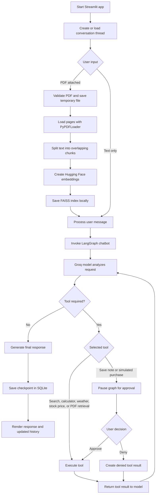
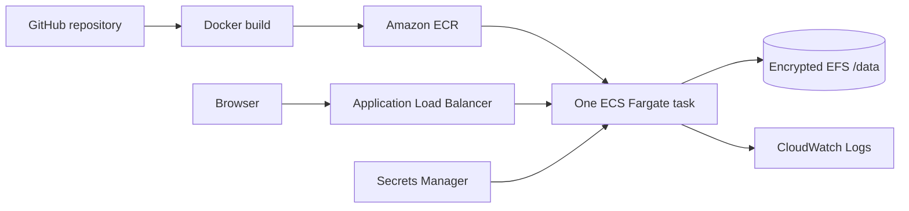

# Agentic Chatbot with LangGraph

A Streamlit chatbot that uses Groq and LangGraph to select tools, retrieve information from uploaded PDFs, persist conversations, and pause for human approval before sensitive actions.

## Features

- Groq-powered conversational agent
- LangGraph tool routing and SQLite conversation checkpoints
- Tavily web search
- Current weather and stock price lookups
- PDF upload, FAISS indexing, and retrieval-augmented generation (RAG)
- Calculator and local note-saving tools
- Human-in-the-loop approval for note creation and simulated stock purchases
- Streamlit chat interface with conversation history

## Application Flow



## How It Works

1. Streamlit creates a conversation thread ID and loads any existing messages from the LangGraph SQLite checkpointer.
2. The user's message is sent to the compiled LangGraph workflow in `agentic_hitl.py`.
3. The Groq model receives the system prompt, up to eight recent messages, and the available tool definitions.
4. The model either returns a direct answer or requests one or more tools.
5. Read-only tools run immediately. Tools with side effects trigger a LangGraph `interrupt` and pause the current thread.
6. Streamlit displays the pending tool name, reason, and arguments. The user can approve or deny the action.
7. The graph resumes with the decision, sends the tool result back to the model, and produces a final response.
8. LangGraph stores each checkpoint in `chatbot.db`, allowing conversations and interrupted actions to survive Streamlit reruns.

## Architecture

| Component | Responsibility |
| --- | --- |
| `app.py` | Renders the Streamlit interface, handles uploads, manages thread IDs, and presents approval requests. |
| `agentic_hitl.py` | Defines the model, graph state, routing nodes, tool execution, interrupts, and SQLite checkpointing. |
| `tools.py` | Implements web search, calculations, weather, stock prices, note writing, and simulated purchases. |
| `rag.py` | Loads PDFs, splits pages into chunks, creates embeddings, stores the FAISS index, and retrieves matching text. |

The main graph has two nodes:

- `chat`: asks the model whether it can answer directly or needs a tool.
- `tools`: validates approval when required, executes tool calls, and returns `ToolMessage` results.

After a tool result, the graph routes back to `chat`. This loop continues until the model returns a response with no additional tool calls.

## Tech Stack

| Area | Technology |
| --- | --- |
| User interface | Streamlit |
| Agent orchestration | LangGraph |
| LLM provider | Groq through `langchain-groq` |
| Web search | Tavily |
| Document loading | PyPDF |
| Embeddings | Hugging Face Sentence Transformers |
| Vector search | FAISS |
| Conversation persistence | SQLite LangGraph checkpointer |
| HTTP integrations | Requests |

## Tool Routing

| Tool | Purpose | Approval required |
| --- | --- | --- |
| `search_tool` | Search current web information with Tavily. | No |
| `calculator` | Evaluate a mathematical expression in a restricted environment. | No |
| `get_stock_price` | Retrieve a current quote from Alpha Vantage. | No |
| `get_current_weather` | Retrieve current conditions from OpenWeather. | No |
| `rag_tool` | Search the currently indexed PDF. | No |
| `save_note` | Write text into the local `notes/` directory. | Yes |
| `buy_stock` | Simulate purchasing a positive whole number of shares. | Yes |

The application may force a specific tool for explicit note-saving and stock-purchase requests. For a purchase request, it first retrieves the stock price when one is not already present in recent conversation history.

## PDF RAG Flow

When a PDF is attached, the application:

1. Accepts PDF files up to 20 MB and writes the upload to a temporary location.
2. Extracts readable pages with `PyPDFLoader`.
3. Splits content into 1,000-character chunks with 150 characters of overlap.
4. Embeds each chunk with `sentence-transformers/all-MiniLM-L6-v2`.
5. Replaces the local FAISS index in `faiss_db/`.
6. Retrieves the three most relevant chunks when `rag_tool` is called.
7. Limits retrieved context to 6,000 characters before returning it to the agent.

Only one local PDF index is active at a time. Uploading another PDF replaces the previous index.

## Requirements

- Python 3.11 or newer
- Internet access for Groq, Tavily, external tools, and the first embedding-model download
- Groq and Tavily API keys to start the complete application

## Setup

1. Create and activate a virtual environment.

   Windows PowerShell:

   ```powershell
   py -m venv .venv
   .\.venv\Scripts\Activate.ps1
   ```

   macOS or Linux:

   ```bash
   python3 -m venv .venv
   source .venv/bin/activate
   ```

2. Install the dependencies.

   ```bash
   python -m pip install -r requirements.txt
   ```

3. Copy the environment template.

   Windows PowerShell:

   ```powershell
   Copy-Item .env.example .env
   ```

   macOS or Linux:

   ```bash
   cp .env.example .env
   ```

4. Add your API keys to `.env`.

   ```dotenv
   GROQ_API_KEY=your_groq_api_key
   TAVILY_API_KEY=your_tavily_api_key
   ALPHA_VANTAGE_API_KEY=your_alpha_vantage_api_key
   OPENWEATHER_API_KEY=your_openweather_api_key
   ```

## Environment Variables

| Variable | Required | Purpose |
| --- | --- | --- |
| `GROQ_API_KEY` | Yes | Authenticates the Groq chat model. |
| `TAVILY_API_KEY` | Yes | Initializes and authenticates web search. |
| `ALPHA_VANTAGE_API_KEY` | No | Enables current stock price lookups. |
| `OPENWEATHER_API_KEY` | No | Enables current weather lookups. |
| `APP_DATA_DIR` | No | Root directory for SQLite, FAISS, and notes; defaults to the project directory. |

Do not commit `.env`. The repository includes only `.env.example` with placeholder values.

## Run

```bash
streamlit run app.py
```

Open the local URL printed by Streamlit, typically `http://localhost:8501`.

## Publish to GitHub

Create an empty repository on GitHub without a generated README, license, or `.gitignore`. Then run these commands from this project directory:

```powershell
git status
git add .
git commit -m "Prepare agentic chatbot for deployment"
git branch -M main
git remote add origin https://github.com/YOUR_USERNAME/agentic-chatbot.git
git push -u origin main
```

If `origin` already exists, inspect it with `git remote -v` and update it with `git remote set-url origin URL` only when needed. Authenticate through Git Credential Manager, GitHub CLI, or an SSH key; never embed a personal access token in the remote URL.

Before pushing, confirm that `.env`, `chatbot.db`, `faiss_db/`, and `notes/` do not appear in `git status`.

## Deploy to AWS

The included deployment targets one ECS Fargate task behind an Application Load Balancer. An encrypted EFS access point mounts at `/data`, Secrets Manager supplies API keys, ECR stores the image, and CloudWatch receives logs.



Follow [docs/aws-deployment.md](docs/aws-deployment.md) for prerequisites, local container testing, secret creation, deployment, verification, updates, rollback, and cleanup. Running the AWS resources incurs charges. No AWS resources are created by this repository until you execute the deployment helper.

## Testing and Validation

Run the deterministic unit tests:

```bash
python -m unittest discover -s tests -v
```

Run syntax and dependency checks:

```bash
python -m compileall -q agentic_hitl.py app.py rag.py tools.py tests
python -m pip check
```

The unit tests do not call paid or external APIs. Live Groq, search, weather, stock, and end-to-end RAG behavior require network access and valid credentials.

## Using the App

- Enter a question to let the agent choose an appropriate tool.
- Attach a PDF in the chat input to replace the current local document index.
- Ask questions about the uploaded PDF to use RAG retrieval.
- Requests to save notes or simulate a stock purchase pause until you approve or deny the tool call.
- Previous conversations are available from the sidebar.

Stock purchases are simulations only. No broker is contacted and no real money is used.

## Project Structure

```text
agentic-chatbot/
|-- .streamlit/
|   `-- config.toml      Streamlit light and dark themes
|-- tests/
|   `-- test_tools.py    Deterministic tool and security tests
|-- .env.example         Safe environment-variable template
|-- .dockerignore        Docker build-context exclusions
|-- .gitignore           Local and generated file exclusions
|-- Dockerfile           Non-root production container image
|-- agentic_hitl.py      LangGraph agent and approval workflow
|-- app.py               Streamlit entry point
|-- docs/
|   `-- aws-deployment.md AWS deployment and operations guide
|-- infrastructure/
|   `-- aws.yml          ECS, ALB, EFS, IAM, and logging stack
|-- rag.py               PDF ingestion and retrieval
|-- requirements.txt     Pinned Python dependencies
|-- scripts/
|   `-- deploy-aws.ps1   ECR build/push and stack deployment helper
|-- tools.py             Agent tool implementations
`-- README.md            Project documentation
```

At runtime, the app creates `chatbot.db`, `faiss_db/`, and `notes/` under `APP_DATA_DIR`. The variable defaults to the project directory locally and is set to the EFS mount at `/data` on ECS. These paths contain local state and are excluded by `.gitignore`. The embedding model is downloaded on first use and may make the initial startup slower.

## Local Data

- `chatbot.db` contains persisted conversation checkpoints and pending graph state.
- `faiss_db/index.faiss` contains document vectors.
- `faiss_db/index.pkl` contains the corresponding document metadata.
- `notes/*.txt` contains notes written after explicit approval.
- Uploaded temporary PDF files are removed after indexing.

To reset conversation history, stop the app and remove `chatbot.db`. To reset document retrieval, remove the contents of `faiss_db/` and upload another PDF.

## Known Limitations

- The FAISS index is shared by the running application rather than isolated per conversation or user.
- Conversation and vector state use shared files, so local and AWS deployments must run only one application process or ECS task.
- The model receives only the eight most recent messages from a conversation.
- The app has no user authentication or access control.
- Stock purchases are simulations and are not connected to a brokerage.
- Live integrations depend on third-party availability, quotas, and rate limits.

## Future Improvements

- Isolate uploaded document indexes by conversation or authenticated user.
- Add authentication before deploying beyond a trusted local environment.
- Add mocked integration tests for graph interrupts and API failures.
- Add continuous integration for tests, compilation, and dependency checks.
- Replace pickle-backed FAISS metadata with a safer portable storage format.

## Contributing

Create a focused branch, keep changes scoped, and run the test and validation commands above before opening a pull request. Do not include `.env`, local databases, document indexes, uploaded files, or generated notes.

## Troubleshooting

- **Chat does not respond:** verify `GROQ_API_KEY` and check the terminal for the underlying API error.
- **Web search fails:** verify `TAVILY_API_KEY`.
- **Weather or stock tools report missing configuration:** add the corresponding key to `.env` and restart Streamlit.
- **PDF questions cannot find an index:** upload a PDF and wait for the indexing confirmation before asking questions.
- **First startup is slow:** the Hugging Face embedding model may still be downloading.
- **PowerShell blocks activation:** run `Set-ExecutionPolicy -Scope Process RemoteSigned`, then activate the environment again.

## Security

Keep `.env`, `chatbot.db`, and locally uploaded or generated data out of version control when they contain sensitive information. The application loads the local FAISS metadata with deserialization enabled, so only use indexes you created or trust.

The calculator parses an allowlisted arithmetic expression syntax and does not execute arbitrary Python code. Uploaded PDFs use unique temporary filenames and are deleted after indexing.

## License

No license has been added. Until the repository owner selects one, the project remains under default copyright restrictions.