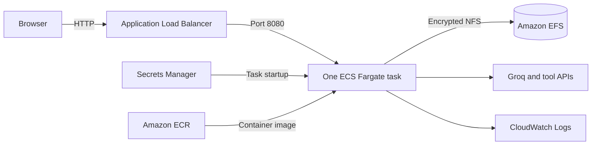

# Deploy to AWS

This guide deploys one Streamlit task on Amazon ECS Fargate behind an Application Load Balancer. Amazon EFS persists SQLite checkpoints, the FAISS index, and approved notes. API keys come from AWS Secrets Manager, and container logs go to CloudWatch Logs.

> AWS charges apply for the load balancer, Fargate task, EFS, Secrets Manager, ECR, and logs. Complete the cleanup section when the deployment is no longer needed.

## Architecture



The service intentionally runs exactly one task. SQLite and the shared FAISS index are not safe for concurrent writers. Deployments stop the old task before starting the new task, which avoids concurrent access but creates a short maintenance window.

## 1. Prerequisites

Install and start:

- Docker Desktop with Linux containers
- AWS CLI v2
- Git

Use an AWS IAM Identity Center profile instead of long-lived access keys:

```powershell
aws configure sso
aws sso login --profile YOUR_PROFILE
$env:AWS_PROFILE = "YOUR_PROFILE"
$env:AWS_REGION = "us-east-1"
aws sts get-caller-identity
```

Your deployment identity needs permission to manage CloudFormation, ECR, ECS, EC2 networking and security groups, Elastic Load Balancing, EFS, IAM roles, and CloudWatch Logs. It also needs permission to pass the two roles created by the stack.

## 2. Test the container locally

From the repository root:

```powershell
docker build --tag agentic-chatbot:local .
docker volume create agentic-chatbot-data
docker run --rm --name agentic-chatbot `
  --publish 8080:8080 `
  --env-file .env `
  --env APP_DATA_DIR=/data `
  --mount source=agentic-chatbot-data,target=/data `
  agentic-chatbot:local
```

In another terminal, verify the health endpoint:

```powershell
Invoke-WebRequest http://localhost:8080/_stcore/health
```

Stop the foreground container with `Ctrl+C`.

## 3. Create the API secret

In the AWS console, open **Secrets Manager**, choose **Store a new secret**, and select **Other type of secret**. Create a JSON secret with these exact keys:

```json
{
  "GROQ_API_KEY": "replace-me",
  "TAVILY_API_KEY": "replace-me",
  "ALPHA_VANTAGE_API_KEY": "replace-me",
  "OPENWEATHER_API_KEY": "replace-me"
}
```

All four JSON fields must exist because the ECS task definition references each one. Copy the resulting secret ARN. Do not put secret values in CloudFormation parameters, Git, command history, or the Docker image.

## 4. Choose access scope

The stack defaults to `0.0.0.0/0`, which makes the HTTP load balancer reachable from the internet. The app has no authentication, so use your public IPv4 address with `/32` while testing:

```powershell
$allowedCidr = "203.0.113.10/32"
```

For a real public deployment, add authentication and terminate HTTPS on the load balancer with an ACM certificate and custom domain before widening access.

## 5. Build, push, and deploy

The helper creates or reuses an encrypted ECR repository, builds a unique image tag, pushes it, resolves its digest, and deploys the CloudFormation stack. It does not delete resources.

```powershell
.\scripts\deploy-aws.ps1 `
  -Region $env:AWS_REGION `
  -ApiSecretArn "arn:aws:secretsmanager:REGION:ACCOUNT_ID:secret:SECRET_NAME" `
  -AllowedCidr $allowedCidr
```

The first deployment can take several minutes while EFS mount targets, the load balancer, and the Fargate service become ready. The script prints the application URL when CloudFormation finishes.

The task runs in public subnets so it can call third-party APIs without a NAT gateway. Its security group accepts inbound traffic only from the load balancer. EFS accepts NFS traffic only from the task security group.

## 6. Verify the deployment

```powershell
aws cloudformation describe-stacks `
  --stack-name agentic-chatbot `
  --region $env:AWS_REGION `
  --query "Stacks[0].Outputs" `
  --output table

$url = aws cloudformation describe-stacks `
  --stack-name agentic-chatbot `
  --region $env:AWS_REGION `
  --query "Stacks[0].Outputs[?OutputKey=='ApplicationUrl'].OutputValue | [0]" `
  --output text

Invoke-WebRequest "$url/_stcore/health"
```

Inspect recent application logs:

```powershell
aws logs tail /ecs/agentic-chatbot --follow --region $env:AWS_REGION
```

Upload a PDF, start a conversation, and create an approved note. Redeploy the same stack and confirm that all three persist; they are stored under `/data` on EFS.

## 7. Deploy updates

Commit and push the code, then rerun the deployment helper. It uses the Git commit as the image tag when available and deploys the immutable image digest:

```powershell
.\scripts\deploy-aws.ps1 `
  -Region $env:AWS_REGION `
  -ApiSecretArn "YOUR_SECRET_ARN" `
  -AllowedCidr $allowedCidr
```

After changing a secret value, force a fresh deployment so ECS injects the new version:

```powershell
aws ecs update-service `
  --cluster agentic-chatbot `
  --service agentic-chatbot `
  --force-new-deployment `
  --region $env:AWS_REGION
```

Use the actual `ClusterName` and `ServiceName` stack outputs if you changed `-StackName`.

## 8. Roll back

CloudFormation enables the ECS deployment circuit breaker and automatic rollback. For a manual application rollback, find a previous digest in ECR and redeploy the stack with that digest as `ImageUri`:

```powershell
aws ecr describe-images `
  --repository-name agentic-chatbot `
  --region $env:AWS_REGION `
  --query "reverse(sort_by(imageDetails,& imagePushedAt))[*].[imageDigest,imagePushedAt]" `
  --output table
```

Then run `aws cloudformation deploy` with the same options used by the helper and `ImageUri=REPOSITORY_URI@PREVIOUS_DIGEST`.

## 9. Clean up

Delete the stack when finished:

```powershell
aws cloudformation delete-stack --stack-name agentic-chatbot --region $env:AWS_REGION
aws cloudformation wait stack-delete-complete --stack-name agentic-chatbot --region $env:AWS_REGION
```

The EFS file system is deliberately retained to prevent accidental data loss. The ECR repository and secret are outside the stack. Delete those resources manually only after confirming that their data is no longer needed:

```powershell
aws ecr delete-repository `
  --repository-name agentic-chatbot `
  --force `
  --region $env:AWS_REGION
```

To remove the retained file system, find the `FileSystemId` in the stack outputs before deleting the stack, then delete the file system from the EFS console after taking any required backup. Schedule secret deletion from Secrets Manager separately.

## Production follow-ups

- Add OIDC authentication before allowing broad public access.
- Add HTTPS with ACM and Route 53.
- Use private subnets plus NAT or VPC endpoints when the additional cost is justified.
- Replace SQLite and shared FAISS storage before increasing the ECS desired count above one.
- Add AWS WAF, alarms, and automated backup restore tests for a public production service.